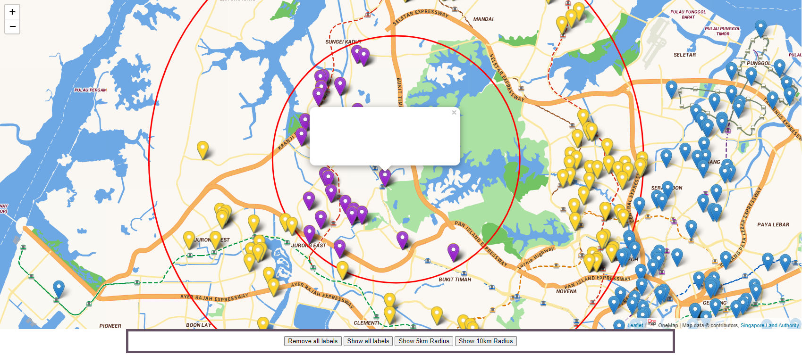

# Map visualization

A simple Map visualization project that utilizes [OneMap API](https://www.onemap.gov.sg/home/) as a basemap and [Leaflet JS](https://leafletjs.com/) for all the mapping features you need.

## How to use

Its good practise to setup a virtual env and install the dependencies.

```python
python -m venv .venv
pip install -r requirements.txt
```

1) Replace the dataBase.xlsx file with your own set of data.
    - It should contain at least a postal code or some form of address to query to OneMap API to obtain Lat/Long X/Y Coords in SVY21.

<br />

2) If the excel does not contain headers, remember to admend this line and add in the necessary labels for the columns.

```python
file_df = pd.read_excel(".venv/dataFiles/dataBase.xlsx", header= None)
file_df.columns = [""] # Replace with the column names
```

3) The script will extract the postal codes under the column **'Postal code'** and dump the info into a text file.

4) It will then take the data from that text file and pass it through the OneMap API service to obtain Lat/Long/X/Y information and store them accordingly.

5) Lastly, all the information that you want to display is condensed into the dataframe 'focus_df' and converted to a dictionary which is stored in 'final_info.txt'.
    - The whole text file should be copied into the JS file to be indexed.  

6) The webpage will have filter buttons to select the closest addresses to your current location. (Filtered by distance)

## Sample


